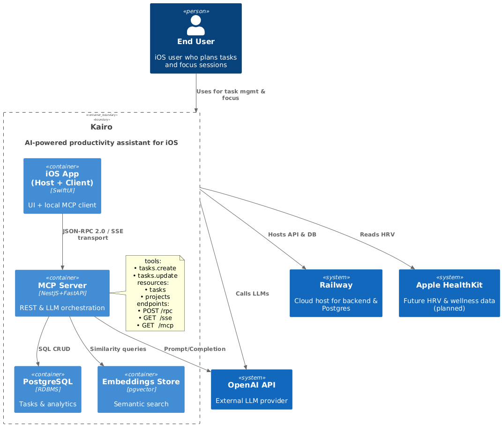

# Kairo App — Architecture & System Overview

Kairo is an AI-powered productivity and task management app designed to help users plan, focus, and complete deep work with minimal distractions. It blends traditional task management tools with advanced LLM-assisted workflows, a distraction-blocking interface, and smart suggestions based on user behavior.

## What Kairo Does

- Enables users to manage tasks, projects, and focus sessions
- Uses natural language input to create, organize, and update tasks via AI
- Tracks session history, task completion, and insights over time
- Blocks distractions and integrates calendar/planning features
- Supports reminders, Pomodoro, and productivity metrics
- Offers an AI agent experience (via chat interface) for planning assistance

## Current Status

- The app is currently in development and runs locally via the Xcode Simulator
- Frontend (SwiftUI) is functional but undergoing active bug fixing and testing
- Backend architecture is fully operational and hosted on Railway
- AI interactions are integrated using OpenAI APIs with support for MCP

## Key Technologies

- **Frontend:** SwiftUI (iOS)
- **Backend:** NestJS (TypeScript) for API + PostgreSQL (via Railway)
- **AI Layer:** Model Context Protocol (MCP) integrated with OpenAI APIs
- **Infrastructure:** Railway (backend, DB hosting), Xcode Simulator (iOS testing)

## Architecture Overview

The Kairo system is organized around a clean separation of concerns between the iOS frontend, the backend server (MCP), and the PostgreSQL database. The architecture is aligned with the Model Context Protocol (MCP) 2024 specification.

### Diagram

### Components

- **Host (iOS):** Responsible for managing the lifecycle of the client and user interaction logic.
- **Client (iOS):** Implements the chat-based UI and task interface. Sends prompts and data to the MCP Server.
- **MCP Server (Hosted on Railway):** Implements REST endpoints for task CRUD and supports MCP-compliant interaction with LLMs (currently OpenAI).
- **API Layer:** Sits between the iOS app and MCP Server, abstracts prompt formatting and task transformation.
- **PostgreSQL (Railway):** Stores user tasks, projects, sessions, and metadata for analytics and AI tuning.

## Design Philosophy

- **LLM-Native Planning:** Tasks and sessions are created through natural language processing
- **Context-Aware Agents:** The MCP architecture allows dynamic memory and multi-agent contexts
- **Minimal Frontend Logic:** Most reasoning and planning logic is offloaded to the backend and LLMs
- **Scalable Backend:** Hosted on Railway for simple CI/CD and scaling

## Future Plans

- Full UI polish and App Store launch
- Offline sync support
- Deeper calendar and health data integrations (Apple Watch)
- Additional model support (Claude, Gemini, OSS)

---

For questions or collaboration, contact Rafael — solo developer and founder of Kairo.
